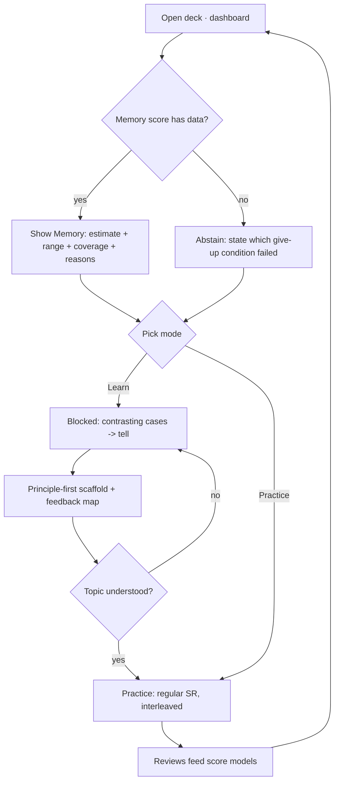

# Speedrun: Product Requirements Document

> Speedrun is a desktop + mobile study app forked from Anki, built for **one exam (the MCAT)**, that does what flashcards alone can't: it separates and honestly reports **three different things**, whether you _remember_ a fact, whether you can _apply_ it to a new exam-style question, and what you'd _score_ today, and it teaches application explicitly instead of hoping it emerges from volume. This PRD is the user-facing contract for the whole product; mechanism lives in the companion specs. The boundary for the live build is the **Wednesday milestone** (core works on both screens, no AI); Friday and Sunday capabilities are specified here as phasing but are not yet "shippable."
>
> **Authority:** frozen initial plan, written before implementation. For current truth read `AGENTS.md` + the [decision log](decisions.md); where a later decision conflicts with this doc, the decision wins.

## 1. Overview

- **Product:** Speedrun, a fork of Anki. The name is the deadline: one exam, one week, two apps on one engine.
- **Persona:** a pre-med studying for the MCAT. Reviews at a desk in long sessions and on a phone in the gaps between classes. Owns a large MCAT deck, already trusts Anki's memory scheduling, and is anxious about one question above all: _am I actually ready?_
- **Platform / stack:** Desktop = Anki (Rust core `rslib`, Python/Qt `aqt`, Svelte/TS web). Mobile = a fork of **AnkiDroid** rebuilt against the modified Rust backend, so the engine change ships to both ([D13](decisions.md#d13)). One shared Rust engine is non-negotiable.

## 2. Concept & audience

- **Pitch:** Anki tells you what you'll _remember_. Speedrun also tells you what you can _do_ with it, and what you'd _score_, and refuses to show a number it can't back up.
- **Core loop:** study a topic **blocked** (learn it, with worked contrasting cases and a principle-first application step), then let **regular spaced repetition** mix it with confusable topics (retain + discriminate). Reviews feed the three score models. The dashboard shows the scores with ranges, or abstains.
- **Status-quo problem:** flashcard recall ≠ exam performance. Memorizing "mitochondria is the powerhouse of the cell" doesn't mean you can answer a cellular-respiration passage. The gap between memory and application is real, under-taught, and usually left to emerge inductively from passage volume ([Brainlift](../../Brainlift%20MCAT.md)). Speedrun measures the gap and teaches across it.
- **Differentiators:** (a) three separated scores with honest uncertainty, never one blended "78% ready"; (b) application taught explicitly via a principle-first scaffold, not implied by practice volume; (c) a real engine change shared across desktop and phone.

## 3. The honesty contract (the spine of the product)

Mixing memory, performance, and readiness into one number is the easiest way to fail. They are three different questions and the product shows them **separately, never blended** ([D7](decisions.md#d7)):

| Score           | The question it answers                                                      | Live in                                                |
| :-------------- | :--------------------------------------------------------------------------- | :----------------------------------------------------- |
| **Memory**      | Will the student recall a fact they were taught, right now?                  | **Wednesday** (FSRS-derived)                           |
| **Performance** | Will they get a _new, exam-style_ question right, including ones never seen? | Friday/Sunday (designed here, [D10](decisions.md#d10)) |
| **Readiness**   | What would they score on the 472–528 scale today, and how sure are we?       | Friday/Sunday (designed here, [D10](decisions.md#d10)) |

**Every score, whenever shown, carries the same evidence envelope.** This is a hard requirement, not a nicety:

1. the point estimate,
2. the likely range (never a bare number),
3. the percent of the exam covered so far,
4. a "how sure" indicator,
5. the time it was last updated,
6. the main reasons behind it,
7. and the give-up rule that makes it show nothing.

**The give-up rule.** The app shows **no score** when it lacks data. Speedrun's line ([D9](decisions.md#d9)): _abstain unless there are at least 200 graded reviews in the score's scope **and** at least 50% coverage of the in-scope topics._ Below the line the UI states which condition failed and what would clear it. A good system knows when it does not know.

A confident number with none of that behind it is a guess in a nice font, and the grade treats it as an automatic fail. See scores spec: [`spec-scores`](spec-scores.md).

## 4. UX walkthrough (a Wednesday session)

A named session, desktop then phone, end to end on the no-AI build:

1. **Open the deck.** Maya opens Speedrun to her MCAT deck. The dashboard shows a **Memory** card: point estimate, range, "62% of in-scope topics covered," last-updated, and the top reasons. Readiness and Performance tiles read **"Not enough data yet, needs 2 practice-question sets and 50% coverage"** rather than a fake number.
2. **Pick a mode.** Two clear entries: **Learn** (topic-grouped / blocked) and **Practice** (regular spaced repetition). She taps Learn → _Amino acid metabolism_ ([D20](decisions.md#d20)).
3. **Learn it (contrasting cases → tell).** Two worked cases sit side by side; she states the shared underlying concept before it is confirmed ([D6](decisions.md#d6)).
4. **Apply it (principle-first scaffold).** Before solving, she drills a short hierarchy, principle then concept then procedure, choosing from the MCAT topic tree at each level. A wrong choice gets an immediate discriminating-cue correction; only a complete correct path unlocks the worked solution ([D5](decisions.md#d5)).
5. **Retain it (Practice).** Later she switches to Practice; regular SR now mixes amino-acid cards with confusable pathways, training discrimination ([D2](decisions.md#d2)). The blocked→interleaved handoff is gated on her grasp of the topic, not a fixed count ([D4](decisions.md#d4)).
6. **On the phone.** On the bus she opens the AnkiDroid-based companion, loads the same deck, and runs a real review session on the shared engine. (Two-way sync is Friday; Wednesday is shared-engine review.)

## 5. The two-section study model (why it's ordered this way)

The product's pedagogy is one decision made visible: **block, then interleave**, with an explicit application step bridging the two. Grounding lives in [`spec-study-model`](spec-study-model.md) §3; the short version:

- **Learn (blocked) first** builds the per-topic schema, contrasting cases let the learner abstract deep structure instead of memorizing surface features (Gick & Holyoak 1983; Chi, Feltovich & Glaser 1981).
- **Principle-first scaffold** sits between learning and unguided practice: identify _which principle → which concept → then the procedure_, with feedback that catches identification errors early (Dufresne, Gerace, Hardiman & Mestre 1992, the scaffold needs feedback to pay off, which is exactly what the feedback map provides).
- **Practice (interleaved SR) second** trains discrimination between confusable topics and drives durable retention. Interleaving pays off long-term but _hurts if introduced before the topic is understood_, so the handoff is mastery-gated, not time-gated (Kaminske et al. 2020; Firth et al. 2021; Hwang 2024).

## 6. Phasing (scope roadmap, not a build order)

| Phase         | Ships                                                                                                                                                                               | Scores live              | AI                       |
| :------------ | :---------------------------------------------------------------------------------------------------------------------------------------------------------------------------------- | :----------------------- | :----------------------- |
| **Wednesday** | Both apps run + review the same deck; the Rust topic-queue change end-to-end; honest **Memory** score; clean-machine desktop installer; phone loads deck + reviews on shared engine | Memory only              | None                     |
| **Friday**    | AI card generation/grading (sourced, eval'd, beats a baseline); two-way phone↔desktop sync; offline-then-sync                                                                       | + Performance, Readiness | On, with kill-switch     |
| **Sunday**    | Calibration + held-out evals; study-feature ablation (full / feature-off / plain Anki); packaged desktop installer + signed phone build; conflict-resolved sync                     | All three, proven        | Eval'd, degrades cleanly |

## 7. Performance / quality targets

Measured on the shared 50k-card deck; report p50, p95, and worst case for each ([source §10](../../Speedrun_%20A%20Desktop%20+%20Mobile%20Study%20App%20Built%20on%20Anki.md)):

- Button press acknowledged: **p95 < 50 ms** (desktop + phone).
- Next card after grading: **p95 < 100 ms**.
- Dashboard first load: **p95 < 1 s**; refresh: **p95 < 500 ms**, no UI freeze.
- App cold start: **< 5 s** desktop, **< 4 s** phone.
- No screen freeze **> 100 ms**; memory use under a stated cap on a mid-range phone at 50k cards.
- **Zero corrupted collections** across the 20× mid-review crash test, both platforms.

## 8. Out of scope (this phase = Wednesday)

- AI of any kind, card generation, grading, chatbot ([D10](decisions.md#d10)).
- Two-way sync and offline-merge conflict resolution, Friday ([D14](decisions.md#d14)).
- Performance and Readiness _scores_, designed in [`spec-scores`](spec-scores.md), not shown Wednesday ([D10](decisions.md#d10)).
- iOS, the mobile target is AnkiDroid only ([D13](decisions.md#d13)).
- Admissions, test logistics, and any exam other than the MCAT ([Brainlift](../../Brainlift%20MCAT.md) out-of-scope; [D1](decisions.md#d1)).

## 9. Acceptance criteria

> Wednesday ships when all of the following are observable. Friday/Sunday buckets are tracked-deferred and listed for phasing only.

### 9.1 Shared engine + Rust change

1. The forked repo builds from source on a clean machine; the commit hash is recorded.
2. A new review order, the **topic-grouped (blocked) queue**, is selectable and produces cards grouped by MCAT topic, distinct from regular SR order.
3. The change lives in Rust, is exposed via a new protobuf message, and is callable from Python; it ships unchanged to the phone build.
4. ≥3 Rust unit tests and ≥1 Python-level test cover it; undo works and the collection does not corrupt after using the new queue.
   → Spec: [`spec-engine-topic-queue`](spec-engine-topic-queue.md). Decisions: [D2](decisions.md#d2), [D3](decisions.md#d3), [D16](decisions.md#d16), [D17](decisions.md#d17).

### 9.2 The two-section study model

5. The learner can enter **Learn** (blocked) and **Practice** (regular SR) as distinct modes.
6. In Learn, a topic presents contrasting cases and asks for the shared concept before stating it, and an application card requires completing the principle → concept → procedure hierarchy before the answer.
7. A wrong principle pick yields specific corrective feedback from the static feedback map; no model calls occur (verifiable offline).
8. The blocked→interleaved transition is gated on a per-topic understanding signal, not a fixed review count.
   → Spec: [`spec-study-model`](spec-study-model.md). Decisions: [D2](decisions.md#d2), [D4](decisions.md#d4), [D5](decisions.md#d5), [D6](decisions.md#d6).

### 9.3 Honest Memory score

9. The dashboard shows a Memory score with the full evidence envelope (§3): estimate, range, coverage %, how-sure, last-updated, reasons.
10. When the give-up rule isn't met, the app shows **no Memory number** and states which condition failed.
    → Spec: [`spec-scores`](spec-scores.md). Decisions: [D7](decisions.md#d7), [D8](decisions.md#d8), [D9](decisions.md#d9).

### 9.4 Topics + coverage

11. MCAT topics come from the AAMC content outline; deck cards map to topics via tags; coverage % is computed and displayed.
    → Spec: [`spec-topic-taxonomy`](spec-topic-taxonomy.md). Decisions: [D11](decisions.md#d11), [D12](decisions.md#d12).

### 9.5 Mobile on the shared engine

12. The AnkiDroid-based app builds and runs on a real device or emulator, loads the MCAT deck, and runs a real review session on the shared Rust engine (no JS/Swift scheduler reimplementation).
    → Spec: [`spec-mobile-shared-engine`](spec-mobile-shared-engine.md). Decisions: [D13](decisions.md#d13), [D14](decisions.md#d14).

### 9.6 Scope / negative criteria (must be observably ABSENT on Wednesday)

13. No readiness or performance _number_ is ever displayed (tiles abstain with a reason).
14. No network/model call is required for any Wednesday feature; pulling the network changes nothing.
15. No blended single "overall readiness" score exists anywhere in the UI.
16. The new queue never produces an FSRS interval that the standard scheduler would reject, and never blocks undo.

### 9.7 Tracked-deferred (Friday/Sunday)

- Two-way + offline sync with a documented conflict winner ([source §7b](../../Speedrun_%20A%20Desktop%20+%20Mobile%20Study%20App%20Built%20on%20Anki.md)); AI card check against a 50-item gold set; performance via the paraphrase test; calibration (Brier/log-loss) on held-out reviews; the study-feature ablation. Owned in the respective specs' "Out of scope (now), tracked."

## 10. Cross-cutting edge cases

| #  | Edge case                                                   | Resolution owned by                                                                     |
| :- | :---------------------------------------------------------- | :-------------------------------------------------------------------------------------- |
| 1  | Student memorizes card wording but fails reworded questions | Performance ≠ Memory by design (AC 9, paraphrase test); [`spec-scores`](spec-scores.md) |
| 2  | Huge deck that skips a high-weight topic                    | Coverage gate abstains (AC 10–11); [`spec-topic-taxonomy`](spec-topic-taxonomy.md)      |
| 3  | Two cards stating opposite facts                            | Authoring/quality bar; flagged in [`spec-study-model`](spec-study-model.md) §10         |
| 4  | Student taps "Good" without reading                         | Memory give-up rule + reasons surface low signal (AC 9–10)                              |
| 5  | Topic with almost no history                                | Per-topic abstention, not a guessed score (AC 10)                                       |
| 6  | Same card reviewed on two devices offline                   | Conflict rule, deferred to Friday ([D14](decisions.md#d14))                             |
| 7  | Crash mid-review                                            | Zero-corruption guarantee (AC 4, §7)                                                    |
| 8  | Accurate but too slow for the time limit                    | Timing captured for Performance; designed in [`spec-scores`](spec-scores.md)            |

## 11. Companion documents

| Doc                                                         | Owns                                                                       |
| :---------------------------------------------------------- | :------------------------------------------------------------------------- |
| [`spec-topic-taxonomy`](spec-topic-taxonomy.md)             | AAMC topic tree, tag mapping, weights, coverage %                          |
| [`spec-engine-topic-queue`](spec-engine-topic-queue.md)     | The Rust change: blocked-by-topic queue, protobuf, bindings, tests, safety |
| [`spec-study-model`](spec-study-model.md)                   | Two sections, three mechanisms, the static feedback map                    |
| [`spec-scores`](spec-scores.md)                             | Memory (live) + Performance/Readiness (designed), the give-up rule         |
| [`spec-mobile-shared-engine`](spec-mobile-shared-engine.md) | AnkiDroid fork, shared-engine review, deferred sync                        |
| [`decisions.md`](decisions.md)                              | The decision log (D1–D18)                                                  |

---

Created with the `iris-plan` skill by Iris Cai · maintained with `iris-log`.
