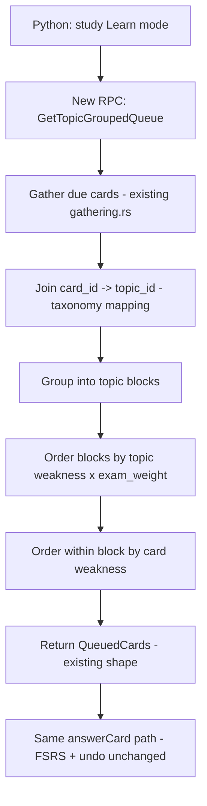

# Spec: Engine, topic-grouped (blocked) queue

> The required real Rust change. A new review order that serves due cards **grouped by AAMC topic**, ordered within a topic block by weakness × topic weight, exposed through a new protobuf message and called from Python, and inherited for free by the phone build. It is a new code path *alongside* Anki's existing interleaved queue, not a rewrite of the scheduler, so FSRS timing and undo stay untouched. Lives in `rslib/src/scheduler/queue/`. Companions: [`spec-topic-taxonomy`](spec-topic-taxonomy.md), [`spec-study-model`](spec-study-model.md), [`spec-mobile-shared-engine`](spec-mobile-shared-engine.md). Decisions: [D3](decisions.md#d3), [D16](decisions.md#d16), [D17](decisions.md#d17). Status: design locked, unbuilt.
>
> **Authority:** frozen initial design. For current truth read `AGENTS.md` + the [decision log](decisions.md); a later decision overrides this doc where they conflict.

## 1. The problem this fills

Anki's queue builder interleaves due cards across the whole collection by design. The Brainlift's "block, then interleave" needs the *opposite* available as a mode: serve one topic's due cards together so the learner can build a schema before discrimination practice ([`spec-study-model`](spec-study-model.md) §3). That ordering does not exist in Anki, and faking it in Python would fail the "real Rust change" requirement ([source §7a](../../Speedrun_%20A%20Desktop%20+%20Mobile%20Study%20App%20Built%20on%20Anki.md); 50% grade cap). It belongs in Rust because it's queue construction over the whole due set, on the hot path, and must behave identically on desktop and phone.

## 2. Goals & non-goals

**Goals**
- A selectable **topic-grouped** review order producing topic-contiguous blocks.
- Within-block ordering by weakness × topic weight ([D16](decisions.md#d16)).
- A new protobuf message in `SchedulerService`, surfaced as a snake_case backend method, called from Python ([D17](decisions.md#d17)).
- Provably safe: standard FSRS intervals unchanged, undo intact, no corruption.

**Non-goals**
- Changing *when* cards are due (no interval mutation, that was the rejected topic-aware-scheduling option, [D3](decisions.md#d3)).
- Replacing the default queue (it stays the engine for **Practice** mode).
- New-card gather/limit policy changes (reuse existing deck-config limits).

## 3. Where it slots into Anki

Anki builds queues in `rslib/src/scheduler/queue/builder/mod.rs`: it gathers `DueCard`/`NewCard` holders, then sorts/intersperses them (`builder/sorting.rs`, `builder/intersperser.rs`). The standard `SchedulerService.GetQueuedCards` (`proto/anki/scheduler.proto`) drives review. The change adds a parallel build path keyed off the topic mapping, reusing gathering and the existing `QueuedCards` return shape.



The key safety property: the change only decides **order of presentation**. Grading still flows through the unchanged `answer_card` path, so FSRS scheduling and the undo queue (`rslib/src/scheduler/queue/undo.rs`) never see a new code path.

## 4. The mechanic

1. **Gather** today's due review cards via the existing gatherer (respecting deck + limits).
2. **Join** each card to its `topic_id` from the taxonomy mapping ([`spec-topic-taxonomy`](spec-topic-taxonomy.md) §4); unmapped cards fall to a trailing `unmapped` block.
3. **Order blocks** by `block_priority = topic_weakness × exam_weight`, descending, highest-value weak topics first.
4. **Order within a block** by per-card weakness (lower retrievability first), so the shakiest cards in the topic surface first.
5. **Return** the standard `QueuedCards` payload so the existing review UI and `answer_card` path are reused verbatim.

`topic_weakness` (Wednesday proxy, pre-Performance-model): `1 − recent_topic_accuracy`, blended with mean `1 − FSRS_retrievability` for the topic's cards. Defined once in [`spec-scores`](spec-scores.md) §6 and imported here so weakness has a single definition.

## 5. Scoring / ordering rules

```
block_priority(topic)  = topic_weakness(topic) * topic.exam_weight
card_priority(card)    = 1 - fsrs_retrievability(card)
queue = flatten(
          sort_desc(blocks, by=block_priority)
            .map(block -> sort_desc(block.cards, by=card_priority))
        ) ++ unmapped_block
```

| Topic | weakness | exam_weight | block_priority | Order |
| :-- | :-- | :-- | :-- | :-- |
| Amino acid metabolism | 0.7 | 0.20 | 0.140 | 1 |
| Enzyme kinetics | 0.5 | 0.18 | 0.090 | 2 |
| Glycolysis | 0.3 | 0.22 | 0.066 | 3 |
| (unmapped) | n/a | n/a | n/a | last |

Ordering is **deterministic** given the same inputs, which is what makes it cleanly unit-testable.

## 6. Protobuf & bindings ([D17](decisions.md#d17))

New message + RPC in `proto/anki/scheduler.proto`, mirroring `GetQueuedCards`:

```proto
// in service SchedulerService
rpc GetTopicGroupedQueue(GetTopicGroupedQueueRequest) returns (QueuedCards);

message GetTopicGroupedQueueRequest {
  int64 deck_id = 1;
  uint32 fetch_limit = 2;   // reuse existing QueuedCards return type
}
```

`_backend.py` then exposes `get_topic_grouped_queue(...)`. Because `proto/` drives codegen across Rust/Python/TS, the proto edit lands first and is followed by a full `just check` before downstream code compiles against it.

## 7. Data model

No new collection schema. The change reads:
- due cards (existing tables),
- the card→topic mapping + weights (shipped data, [`spec-topic-taxonomy`](spec-topic-taxonomy.md)),
- FSRS retrievability (existing card state).

Per-topic recent accuracy (for `topic_weakness`) is derived from the existing revlog, so nothing new is persisted on Wednesday.

## 8. Safety: undo & corruption

The brief requires proof that undo works and the collection doesn't corrupt ([source §7a](../../Speedrun_%20A%20Desktop%20+%20Mobile%20Study%20App%20Built%20on%20Anki.md)). Guaranteed structurally: the new RPC is **read-only queue construction**; it issues no card mutations. All grading remains on the stock `answer_card` path with its existing undo support. The 20× mid-review crash test ([PRD §7](prd-speedrun.md#7-performance--quality-targets)) runs against this mode too.

## 9. Acceptance criteria

1. `GetTopicGroupedQueue` returns due cards in topic-contiguous blocks; the default queue is unchanged and still available for Practice mode.
2. Block order follows `block_priority`; within-block order follows `card_priority`; output is deterministic for fixed inputs.
3. The RPC is callable from Python via `_backend.py`; the same backend powers the phone build ([`spec-mobile-shared-engine`](spec-mobile-shared-engine.md)).
4. ≥3 Rust unit tests (grouping correctness, ordering by priority, unmapped-trailing) + ≥1 Python test exercising the RPC end to end.
5. Undo after answering cards from this queue behaves identically to the default queue; 20× crash test yields zero corrupted collections.
6. No FSRS interval is produced or altered by this path (verifiable: intervals match the default queue for the same answers).
7. p95 next-card < 100 ms on the 50k-card deck ([PRD §7](prd-speedrun.md#7-performance--quality-targets)).

## 10. Out of scope (now), tracked

- Topic-aware *rescheduling* (interval changes), explicitly rejected for Wednesday ([D3](decisions.md#d3)); revisit only with strong evidence.
- New-card blocking policy (Wednesday handles due reviews; new-card gather uses existing config).
- Upstream contribution of the queue mode → Sunday stretch ([source §13](../../Speedrun_%20A%20Desktop%20+%20Mobile%20Study%20App%20Built%20on%20Anki.md)).

## 11. Product phasing

- **Wednesday:** topic-grouped queue + proto + bindings + tests + safety proof.
- **Friday/Sunday:** weakness proxy upgraded to use the Performance model's signal once it exists ([`spec-scores`](spec-scores.md)); benchmark via `make bench` ([source §7h](../../Speedrun_%20A%20Desktop%20+%20Mobile%20Study%20App%20Built%20on%20Anki.md)).

## 12. Decisions & alternatives

Owned: [D3](decisions.md#d3), [D16](decisions.md#d16), [D17](decisions.md#d17). The "list upstream files touched + merge difficulty" deliverable ([source §7a](../../Speedrun_%20A%20Desktop%20+%20Mobile%20Study%20App%20Built%20on%20Anki.md)): expect edits to `proto/anki/scheduler.proto`, a new module under `rslib/src/scheduler/queue/builder/`, and `_backend.py`, additive, so merge risk is low except for the proto file.

---

<sub>Created with the `iris-plan` skill by Iris Cai · maintained with `iris-log`.</sub>
