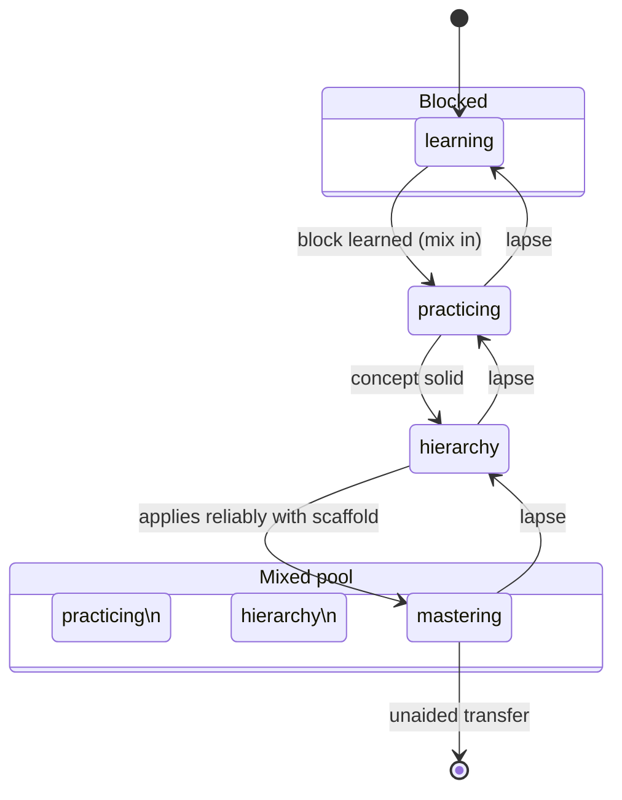

# Spec: Mastery progression (the per-topic learning lifecycle)

> The study model, restructured. One AAMC hierarchy (Foundation → Content Category → Topic) sorts the cards, *is* the principle → concept → procedure ladder the learner walks in application problems, and is the map progress is tracked against. A topic is learned **blocked** (one hierarchy block at a time), then **mixed** into the interleaved pool, and from there each topic climbs a four-state lifecycle whose cards **upgrade** to match the state, with the scaffold fading at the end. This supersedes the flat two-mode (Learn/Practice) model. Companions: [`spec-engine-topic-queue`](spec-engine-topic-queue.md), [`spec-topic-taxonomy`](spec-topic-taxonomy.md), [`spec-study-model`](spec-study-model.md) (superseded for §4-§6), [`spec-scores`](spec-scores.md). Decisions: [D30](decisions.md#d30), [D31](decisions.md#d31), [D32](decisions.md#d32). Status: built + verified on `main` (Rust 33+13, templates 184, pylib 36 / qt 42 green); single Study button + topic breadcrumb (U1/U2) and correctness fixes F1-F3 ([B026-B028](backlog.md)) landed.
>
> **Authority:** current design (supersedes the two-mode model in `spec-study-model` §4-§6). For current truth read `AGENTS.md`/`README` + the decision log.

## 1. The shape

- **One hierarchy, three jobs.** The taxonomy tree sorts/groups cards, supplies the scaffold's choices, and is the per-node progress map. Same tree everywhere (no second ordering).
- **Two places a card lives:**
  - **Blocked section:** topics in the `learning` state, served one hierarchy block at a time, pure first-exposure, nothing else mixed in.
  - **Mixed pool:** once a block is learned it graduates into the interleaved pool and is studied alongside everything already learned.
- **Per-topic lifecycle** (tracked per hierarchy leaf node): `learning → practicing → hierarchy → mastering`. A lapse demotes one state.

## 2. States and card modes

Each state drives which of the topic's cards are active and **how they render** ("upgrade the cards to match"):

| State | Place | Active card → mode | What the learner does |
| :-- | :-- | :-- | :-- |
| `learning` | blocked | `SpeedrunConcept` → **concept-learn** | sees two contrasting cases, states the shared concept, then it's confirmed |
| `practicing` | mixed | `SpeedrunConcept` → **concept-practice** | recalls/practices the concept |
| `hierarchy` | mixed | `SpeedrunApplication` → **application-scaffolded** | solves a problem **with** the principle → concept → procedure scaffold |
| `mastering` | mixed | `SpeedrunApplication` → **application-unscaffolded** | solves the problem with the scaffold **removed**, identifies + solves unaided |

The concept card keeps coming for retention after `learning` (normal SR); the application card is **suppressed until `hierarchy`** (no applying before the concept is in hand). The scaffold is training wheels that fade at `mastering`, which is the transfer goal (internalize the principle-first analysis, then apply without the crutch; Dufresne & Mestre's end state).

## 3. State transitions ([D32](decisions.md#d32))

- A topic **advances** when its active-mode card(s) clear a per-state mastery signal: recent accuracy (button ≥ Good) over the mode's cards above a threshold **and** a minimum number of graded reps (tunable consts; reuse the `topic_weakness` / FSRS-stability machinery from [`spec-scores`](spec-scores.md) §6).
- A **lapse** (Again) on a topic's card demotes the topic one state (e.g., `mastering → hierarchy` re-shows the scaffold). Never below `learning`.
- `learning → practicing` is the graduation that moves the topic from the blocked section into the mixed pool.

## 4. Storage ([D32](decisions.md#d32))

Per-topic state in the **collection config** (a JSON map `topic_id → { state, updated_at }` under a `speedrun_topic_state` key): no schema migration, syncs with the collection, fail-safe (absent = `learning`). The state machine reads/writes this map on answer.

## 5. The card-mode interface (engine ↔ template)

- The engine resolves each served card's **mode** from `(topic_state, note_type)` and which cards are eligible (blocked-first; application suppressed below `hierarchy`; mixed otherwise).
- The reviewer **injects the resolved mode** into the card webview (a `window.speedrunCardMode` value / data attribute), set before render.
- The templates render by mode: `SpeedrunConcept` shows learn vs practice; `SpeedrunApplication` shows the scaffold (scaffolded) or hides it and reveals the worked solution directly after the answer (unscaffolded). The no-AI feedback map and the fail-open Show-Answer gate ([D27](decisions.md#d27)) still apply in `application-scaffolded`.

## 6. Selection (blocked vs mixed) in the queue

Extends the topic-grouped queue ([`spec-engine-topic-queue`](spec-engine-topic-queue.md)):
- If any topic is in `learning`, serve that one highest-priority block (blocked first-exposure) **plus** already-graduated topics' due reviews and interday-learning, so blocking a new topic never starves earlier topics' retention ([B026](backlog.md#b026); there is no separate Practice pass to catch them under the single Study button). Other learning topics' new first-exposures stay withheld. This holds until the block graduates.
- Otherwise serve the mixed pool: graduated topics interleaved, each card in the mode its topic's state dictates, application cards suppressed for topics below `hierarchy`.
- Ordering within still uses weakness × exam-weight; the hierarchy is the grouping key.

## 7. Progress tracking

Per hierarchy node: the state map (§4) gives which nodes are learned and how far (learning/practicing/hierarchy/mastering). Feeds the dashboard (coverage + per-area progress) and, later, the Performance model.

## 8. Acceptance criteria

1. A fresh topic starts in `learning` and is served **blocked** (one block), concept-learn mode.
2. On clearing the learning signal, the topic graduates to the **mixed pool** (`practicing`), concept-practice mode.
3. The application card is **not served** for a topic below `hierarchy`; at `hierarchy` it renders **scaffolded**; at `mastering` it renders **unscaffolded** (scaffold removed).
4. A lapse demotes the topic one state (and re-shows the scaffold if it had faded).
5. Per-topic state persists (collection config) and survives reload; absent state defaults to `learning`.
6. The dashboard shows per-area progress (which nodes are in which state).
7. Additive + undo-safe: scheduling/undo unchanged; non-Speedrun cards unaffected.

## 9. Out of scope (now)

- AI-authored cards/cases (Friday); per-step latency analytics; sync of the state map across devices is automatic via config but untested (Friday).

## 10. Decisions

Owned: [D30](decisions.md#d30) (four-state progression, supersedes the two-mode model), [D31](decisions.md#d31) (state-aware card modes + scaffold fade), [D32](decisions.md#d32) (state storage + transitions + demotion). Extends [D5](decisions.md#d5) (scaffold now fades), [D19](decisions.md#d19) (note types render state-aware), [D27](decisions.md#d27) (gate still applies in scaffolded mode). Supersedes [D2](decisions.md#d2), [D4](decisions.md#d4).

---

Created with the `iris-plan` skill by Iris Cai · maintained with `iris-log`.
