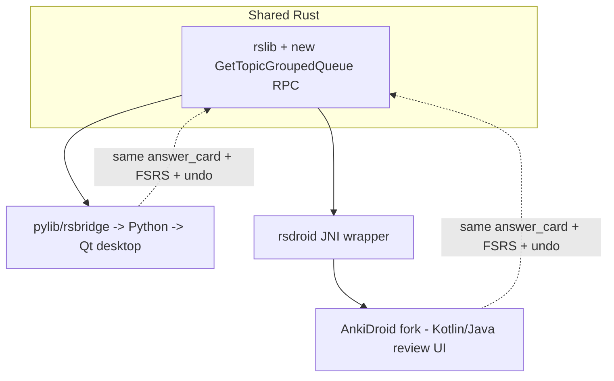

# Spec: Mobile on the shared engine

> The phone companion, built so the engine is genuinely shared, not reimplemented. It's a fork of **AnkiDroid** rebuilt against the modified Rust backend (`rsdroid` → `rslib`), so the topic-grouped queue and everything else in Rust ship to the phone for free. Wednesday's bar is narrow and explicit: build, run on a device/emulator, load the MCAT deck, and run a **real review session on the shared engine**. Two-way sync is Friday. Companions: [`spec-engine-topic-queue`](spec-engine-topic-queue.md). Decisions: [D13](decisions.md#d13), [D14](decisions.md#d14). Status: design locked, unbuilt.
>
> **Authority:** frozen initial design. For current truth read `AGENTS.md` + the [decision log](decisions.md); a later decision overrides this doc where they conflict.

## 1. The problem this fills

The project's hardest day-one risk isn't features, it's getting the same Rust engine running on a phone ([source §"Get Anki Building First"](../../Speedrun_%20A%20Desktop%20+%20Mobile%20Study%20App%20Built%20on%20Anki.md)). Reimplementing the scheduler in Kotlin/JS doesn't count and would fork behavior between devices. AnkiDroid already runs `rslib` on-device via `rsdroid`, so forking it is the shortest path to a *shared* engine that inherits our Rust change.

## 2. Goals & non-goals

**Goals**
- One shared Rust engine across desktop and phone; the Rust change ([`spec-engine-topic-queue`](spec-engine-topic-queue.md)) runs on both.
- AnkiDroid fork builds and runs on a real device or emulator.
- Loads the MCAT deck and runs a real review session on the shared engine.

**Non-goals (Wednesday)**
- Two-way sync, offline-merge, conflict resolution → Friday ([D14](decisions.md#d14)).
- iOS ([D13](decisions.md#d13)).
- A reskinned mobile UI, Wednesday uses AnkiDroid's review UI; Speedrun surfaces come later.

## 3. How the engine is shared

AnkiDroid talks to `rslib` through the protobuf backend, including `AnkidroidService` (`proto/anki/ankidroid.proto`) and the standard `SchedulerService`. Our new RPC lives on `SchedulerService`, so the phone reaches it through the same backend the desktop uses, no separate mobile implementation, which is exactly the "shared engine" the grade requires.

## 4. The mechanic (Wednesday build path)

1. **Fork AnkiDroid**; pin it to our Anki fork's backend.
2. **Rebuild `rsdroid`** against the modified `rslib` (cross-compile the Rust backend for Android ABIs), producing the `.aar` AnkiDroid links.
3. **Wire the fork** to that backend artifact; confirm the new RPC is reachable from the app.
4. **Load the MCAT deck** and run a review session; grading flows through the shared `answer_card` path.

This front-loads the riskiest task ([source warning](../../Speedrun_%20A%20Desktop%20+%20Mobile%20Study%20App%20Built%20on%20Anki.md)): the cross-compile + `.aar` rebuild is the most likely Wednesday blocker, so it's step one, not Thursday's problem.

## 5. Acceptance criteria

1. The AnkiDroid fork builds and runs on a real device or emulator.
2. It loads the MCAT deck and runs a real review session on the shared Rust engine.
3. The backend the phone links is the **modified** `rslib`, the new `GetTopicGroupedQueue` RPC is reachable on-device (proves the engine change shipped to mobile).
4. No scheduler logic is reimplemented in Kotlin/JS; grading uses the shared `answer_card` path.
5. A screen recording of a phone review session is captured for proof ([source §6](../../Speedrun_%20A%20Desktop%20+%20Mobile%20Study%20App%20Built%20on%20Anki.md)).

## 6. Cold-start / the real risk

The cross-compilation toolchain (Android NDK + Rust targets) and the `rsdroid` `.aar` rebuild against a *forked* backend is the single highest-risk item in the whole Wednesday milestone. Layered mitigation: (a) do it first, before any feature work; (b) prove the stock fork builds before modifying the backend, so a break is bisectable to the engine change; (c) keep the Rust change additive ([`spec-engine-topic-queue`](spec-engine-topic-queue.md) §8) so it can't break existing mobile behavior.

## 7. Out of scope (now), tracked

- Two-way + offline sync and the conflict rule (review 10 on phone offline, 10 on desktop, reconnect, none lost/doubled; same card on both → documented winner) → Friday ([source §7b](../../Speedrun_%20A%20Desktop%20+%20Mobile%20Study%20App%20Built%20on%20Anki.md), [D14](decisions.md#d14)).
- The three scores on the phone with ranges + give-up rule → Friday ([`spec-scores`](spec-scores.md)).
- Signed APK / store-ready build → Sunday ([source §6](../../Speedrun_%20A%20Desktop%20+%20Mobile%20Study%20App%20Built%20on%20Anki.md)).
- Speedrun-specific mobile UI (Learn/Practice modes, dashboard) → Friday+.

## 8. Product phasing

- **Wednesday:** shared-engine review on the AnkiDroid fork; new RPC reachable on-device.
- **Friday:** two-way + offline sync; scores on phone; offline AI degradation.
- **Sunday:** conflict-resolved sync; signed build; clean-device install recording.

## 9. Decisions & alternatives

Owned: [D13](decisions.md#d13) (AnkiDroid fork over iOS-FFI / thin-custom), [D14](decisions.md#d14) (sync deferred). The sync transport choice (AnkiWeb vs custom server) is a Friday decision and is intentionally left open; the Wednesday data model ([`spec-scores`](spec-scores.md) §8, [`spec-study-model`](spec-study-model.md) §7) avoids single-device assumptions so either works.

---

Created with the `iris-plan` skill by Iris Cai · maintained with `iris-log`.
