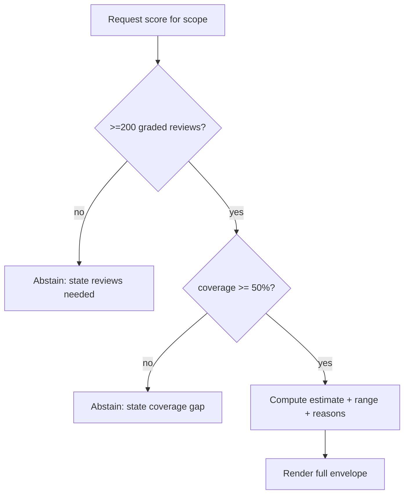

# Spec: Memory / Performance / Readiness scores

> The honesty contract, made mechanical. Three scores, **shown separately, never blended**, each carrying the same evidence envelope, each governed by a give-up rule that shows nothing when data is thin. This is the spine of the grade ([source §4, §9, §11](../../Speedrun_%20A%20Desktop%20+%20Mobile%20Study%20App%20Built%20on%20Anki.md)). Companions: [`spec-topic-taxonomy`](spec-topic-taxonomy.md), [`spec-study-model`](spec-study-model.md). Decisions: [D7](decisions.md#d7), [D8](decisions.md#d8), [D9](decisions.md#d9), [D10](decisions.md#d10), [D33](decisions.md#d33).
>
> **Update ([D33](decisions.md#d33), supersedes the "deferred" status below):** all three scores are now built and shown. **Memory** aggregates FSRS recall (§6). **Performance** is exam-weight-weighted accuracy over `SpeedrunApplication` (exam-style) card attempts, a construct distinct from recall. **Readiness** projects Performance onto 472-528 with a coverage-widened range and abstains whenever Performance does. The original §3/§7 "abstains / deferred" wording is kept below for the record; §6's give-up rule + envelope now apply to all three. What is still deferred: the paraphrase-test validation (Friday) and calibration against real outcomes (Sunday), which the Performance/Readiness reasons state.
>
> **Authority:** frozen initial design. For current truth read `AGENTS.md` + the [decision log](decisions.md); a later decision overrides this doc where they conflict.

## 1. The problem this fills

Students want one number: "am I ready?" That number, unbacked, is the single thing the project forbids, "a guess in a nice font" is an automatic fail ([source §1](../../Speedrun_%20A%20Desktop%20+%20Mobile%20Study%20App%20Built%20on%20Anki.md)). The honest answer is three numbers that measure three different things, each with its uncertainty exposed, and silence when the data can't support any of them. This spec defines those three and the rule for silence.

## 2. Goals & non-goals

**Goals**

- Three independent scores, never combined into one ([D7](decisions.md#d7)).
- A shared evidence envelope rendered identically for all three.
- A single give-up rule, applied per score and per scope ([D9](decisions.md#d9)).
- A Wednesday Memory score that leans on validated FSRS, not a hand-rolled model ([D8](decisions.md#d8)).
- A data model that already carries what Performance/Readiness need ([D10](decisions.md#d10)).

**Non-goals**

- A blended "overall" score, anywhere, ever ([D7](decisions.md#d7)).
- Proving readiness against real exam outcomes this week (no honest data exists in a week; [source §9](../../Speedrun_%20A%20Desktop%20+%20Mobile%20Study%20App%20Built%20on%20Anki.md)).
- Shipping Performance/Readiness numbers on Wednesday ([D10](decisions.md#d10)).

## 3. The three scores

| Score           | Question                               | Wednesday input                                                            | Later input                                                                                   |
| :-------------- | :------------------------------------- | :------------------------------------------------------------------------- | :-------------------------------------------------------------------------------------------- |
| **Memory**      | Recall a taught fact now?              | FSRS retrievability aggregated over in-scope cards ([D8](decisions.md#d8)) | calibration-corrected per Sunday eval                                                         |
| **Performance** | Get a _new_ exam-style question right? | abstains                                                                   | model over topic mastery, item difficulty, timing, coverage; validated by the paraphrase test |
| **Readiness**   | Score on 472–528 today?                | abstains                                                                   | performance → score mapping with a range, weighted by coverage                                |

They are deliberately decoupled: a great memory model is not a great score model, and conflating them hides the memory→performance bridge the project is graded on.

## 4. The evidence envelope (every score, every time)

A score is only ever rendered as this whole object, there is no "bare number" code path ([source §4](../../Speedrun_%20A%20Desktop%20+%20Mobile%20Study%20App%20Built%20on%20Anki.md)):

```
ScoreDisplay {
  estimate        // point estimate
  range           // low..high, always present
  coverage_pct    // % of in-scope exam covered (from taxonomy)
  confidence      // low | medium | high, with the reason
  updated_at      // when computed
  reasons[]       // top drivers ("42% topics covered", "thin history in X")
  abstained       // bool; when true, estimate/range are hidden
  abstain_reason  // which give-up condition failed + what clears it
}
```

The UI for Performance and Readiness on Wednesday is this object with `abstained = true`, the tiles exist and explain themselves, they just hold no number.

## 5. The give-up rule ([D9](decisions.md#d9))

```
eligible(scope) = graded_reviews(scope) >= 200 AND coverage_pct(scope) >= 0.50
```

- Applied per score and per scope (whole-deck and, where shown, per-topic).
- When ineligible: `abstained = true`, and `abstain_reason` names the failed condition ("needs 200 graded reviews, have 140" / "coverage 38% < 50%") and what would clear it.
- Thresholds are named constants, flagged tunable until real data exists ([D9](decisions.md#d9) gap).



## 6. Memory score (Wednesday, buildable) ([D8](decisions.md#d8))

FSRS already yields per-card retrievability `R_i` (probability of recall now). Memory aggregates it:

```
in_scope_cards = cards mapped to in-scope topics with >=1 review
estimate       = mean(R_i for i in in_scope_cards)
range          = bootstrap CI over {R_i}        // spread-based interval, not yet model uncertainty
confidence     = f(n_reviews, coverage_pct)     // low/med/high thresholds
reasons        = largest drivers (low-R topics, coverage gaps)
```

**`topic_weakness` lives here too**, as the single definition imported by the queue and the study model:

```
topic_weakness(topic) = w1 * (1 - recent_topic_accuracy(topic))
                      + w2 * mean(1 - R_i for cards in topic)
```

This is the one place weakness is defined; [`spec-engine-topic-queue`](spec-engine-topic-queue.md) §5 and [`spec-study-model`](spec-study-model.md) §4 consume it. Calibration (does "80%" mean 80%?) is _proven_ Sunday via Brier/log-loss on held-out reviews; Wednesday's claim is only "aggregated FSRS recall with an honest range," not "calibrated."

## 7. Performance & Readiness (designed, deferred) ([D10](decisions.md#d10))

Specified now so the Wednesday schema is forward-compatible:

- **Performance:** a model predicting P(correct on a new exam-style item) from topic mastery, item difficulty, response timing, and coverage. Validated by the **paraphrase test**, 30 cards × 2 reworded questions; if recall ≈ reworded accuracy, the model is just echoing Memory and the bridge isn't built ([source §7d](../../Speedrun_%20A%20Desktop%20+%20Mobile%20Study%20App%20Built%20on%20Anki.md)). Report the gap.
- **Readiness:** map performance → 472–528 with a range, down-weighted by coverage; the display literally pairs the number with "covered X% of topics" ([source §4](../../Speedrun_%20A%20Desktop%20+%20Mobile%20Study%20App%20Built%20on%20Anki.md)).

**Forward-compat requirement on Wednesday:** persist per-attempt **timing** and **item provenance** (which card/problem, seen-before flag) from day one, including the principle picks logged by [`spec-study-model`](spec-study-model.md), so Friday adds models without a migration.

## 8. Data model

```
ScoreSnapshot { scope, score_kind, estimate, range_low, range_high,
                coverage_pct, confidence, reasons_json, abstained, computed_at }
AttemptLog    { card_id, topic_id, correct, duration_ms, seen_before, kind, ts }  // Wednesday: persisted
```

`AttemptLog` is the forward-compatible substrate; `ScoreSnapshot` caches the rendered envelope. Both are per-collection and sync-safe ([D14](decisions.md#d14)).

## 9. Acceptance criteria

1. Memory renders the full envelope (estimate, range, coverage, confidence, updated_at, reasons).
2. Below the give-up line, Memory abstains and names the failed condition; Performance and Readiness abstain on Wednesday by construction.
3. No blended/overall score exists in the UI ([PRD AC 15](prd-speedrun.md#96-scope--negative-criteria-must-be-observably-absent-on-wednesday)).
4. `topic_weakness` has exactly one implementation, imported by the queue and study model.
5. `AttemptLog` persists timing + provenance from Wednesday.
6. Aggregation, interval, give-up, and weakness helpers are unit-tested with fixtures.

## 10. Out of scope (now), tracked

- Calibration chart + Brier/log-loss → Sunday ([source §9 step 1](../../Speedrun_%20A%20Desktop%20+%20Mobile%20Study%20App%20Built%20on%20Anki.md)).
- Performance model + paraphrase test → Friday/Sunday.
- Readiness mapping + range → Friday/Sunday.
- Leakage check on any training data → Friday ([source §7e](../../Speedrun_%20A%20Desktop%20+%20Mobile%20Study%20App%20Built%20on%20Anki.md)).

## 11. Product phasing

- **Wednesday:** Memory live + honest range + give-up rule; Performance/Readiness tiles abstain; `AttemptLog` recording.
- **Friday:** Performance model; Readiness mapping; both respect the same envelope + give-up rule.
- **Sunday:** calibration + held-out evals + the paraphrase gap, reported with nulls.

## 12. Decisions & alternatives

Owned: [D7](decisions.md#d7) (separate, never blended), [D8](decisions.md#d8) (FSRS-aggregate Memory), [D9](decisions.md#d9) (give-up threshold), [D10](decisions.md#d10) (Performance/Readiness deferred). Consumes coverage ([D12](decisions.md#d12)).

---

<sub>Created with the `iris-plan` skill by Iris Cai · maintained with `iris-log`.</sub>
