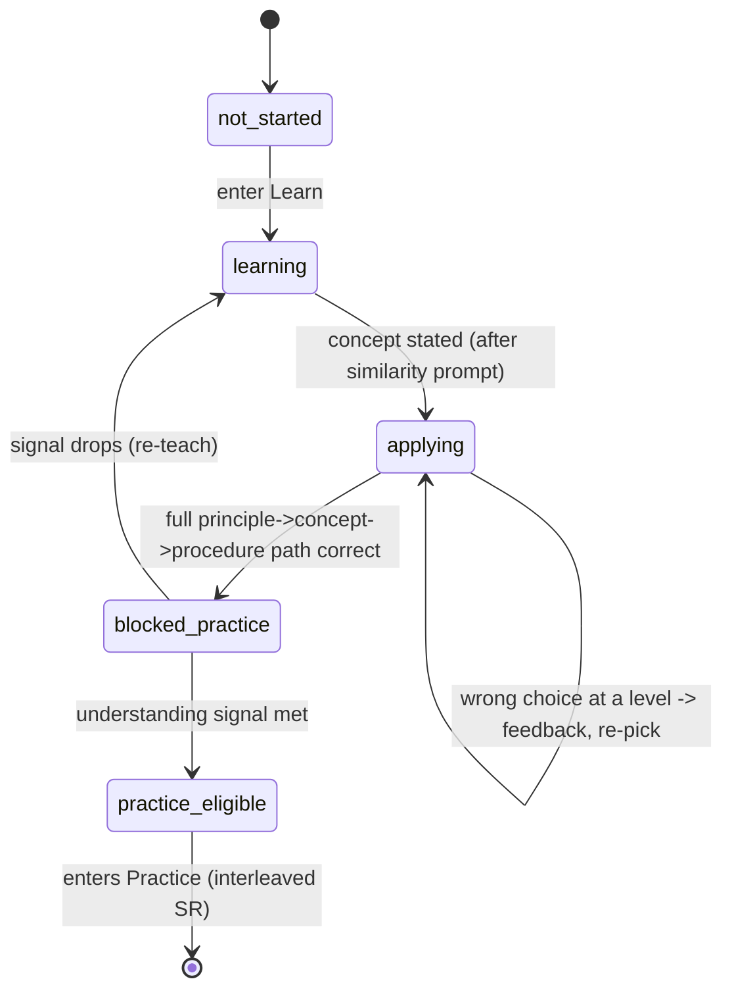
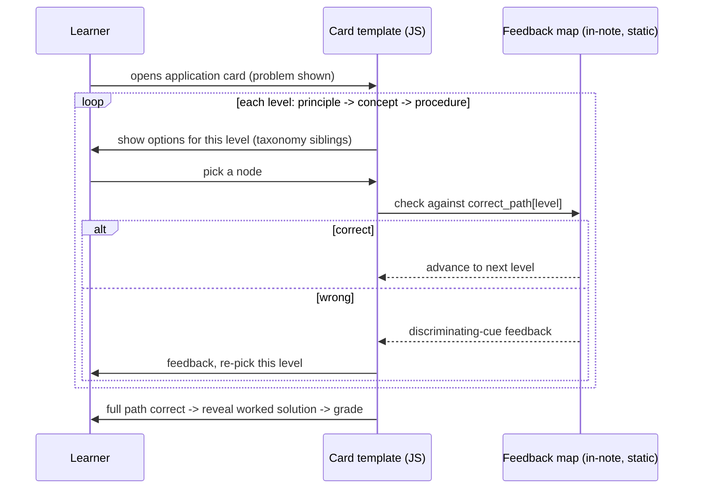
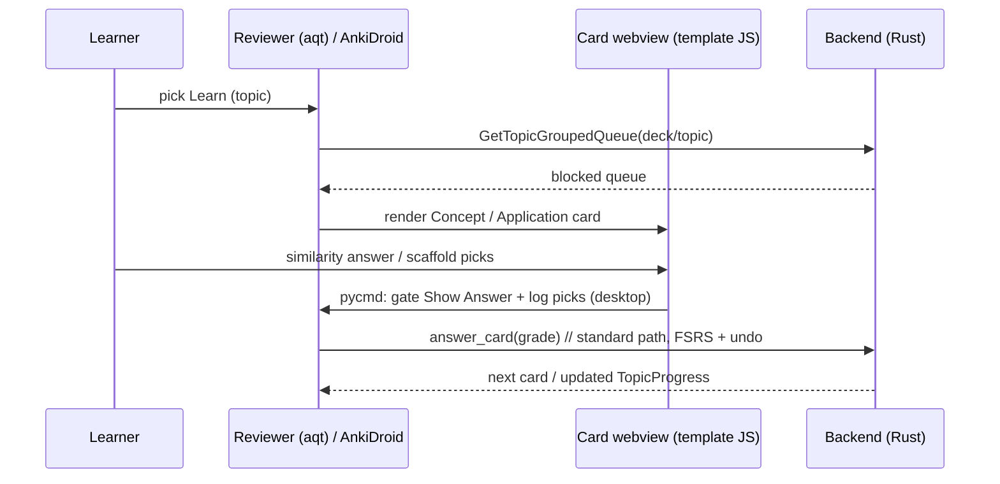

# Spec: The two-section study model

> How Speedrun teaches application instead of hoping it emerges from volume. Two study modes, **Learn** (topic-grouped / blocked) and **Practice** (regular spaced repetition / interleaved), wrap the Brainlift's three mechanisms: contrasting cases then tell, block then interleave, and a principle-first scaffold (a hierarchy of choices) whose identification errors are caught by a **static feedback map** (no AI). The interactions ship as custom Anki note types with card-template JS (rendering on desktop + AnkiDroid), plus a thin desktop reviewer hook in `aqt/`, on top of the engine queue ([D19](decisions.md#d19)). Companions: [`spec-engine-topic-queue`](spec-engine-topic-queue.md), [`spec-topic-taxonomy`](spec-topic-taxonomy.md), [`spec-scores`](spec-scores.md). Decisions: [D2](decisions.md#d2), [D4](decisions.md#d4), [D5](decisions.md#d5), [D6](decisions.md#d6), [D19](decisions.md#d19), [D20](decisions.md#d20), [D21](decisions.md#d21). Status: design locked, unbuilt.
>
> **Authority:** frozen initial design. For current truth read `AGENTS.md` + the [decision log](decisions.md); a later decision overrides this doc where they conflict.

## 1. The problem this fills

Recall is not application. A student can answer "what does hexokinase do?" and still fail a passage that _uses_ hexokinase in an unfamiliar experiment. The MCAT science sections rarely teach this transition top-down; the cultural advice is "do a ton of passages and it'll click" ([Brainlift](../../Brainlift%20MCAT.md)). It usually does click, but inductively and slowly. Speedrun teaches the transition explicitly, as a curriculum of reasoning steps, which is the project's "performance" bet.

## 2. Goals & non-goals

**Goals**

- Two clearly separated study modes mapping to block → interleave.
- An explicit application step (principle-first hierarchy) between learning and unguided practice.
- Feedback on identification errors with **zero model calls** (Wednesday no-AI).
- A mastery-gated handoff from Learn to Practice.
- One implementation that renders on both apps (note types + templates).

**Non-goals**

- AI-generated cases, questions, or grading (Friday+; the feedback map is the no-AI stand-in, [D5](decisions.md#d5)).
- The Performance/Readiness _scores_ (designed in [`spec-scores`](spec-scores.md)).
- Authoring the full MCAT content (Wednesday demonstrates the model on a seeded topic set, [D18](decisions.md#d18)).
- A bespoke reviewer screen (rejected, the card system already renders everywhere, [D19](decisions.md#d19)).

## 3. Grounding (why this shape)

| Mechanism                            | Claim the design rests on                                                                                                              | Source                                             | Caveat the design respects                                                                                                                                |
| :----------------------------------- | :------------------------------------------------------------------------------------------------------------------------------------- | :------------------------------------------------- | :-------------------------------------------------------------------------------------------------------------------------------------------------------- |
| Contrasting cases → tell             | Comparing two analogs and articulating their **shared** structure induces a transferable schema; a single example transfers poorly     | Gick & Holyoak 1983; Chi et al. 1981               | The learner must state the similarity / underlying concept, not just spot differences; the schema forms as a byproduct of describing what the cases share |
| Invent/struggle before telling       | Cases-then-told beats told-then-cases for transfer                                                                                     | Schwartz et al. 2011; Steenhof et al. 2019         | Productive _failure_, not unproductive flailing, keep cases bounded                                                                                       |
| Block → interleave                   | Blocked practice builds the schema; interleaving then trains discrimination + durable retention                                        | Kaminske et al. 2020; Firth et al. 2021            | Interleaving **before** understanding is an undesirable difficulty that backfires (Hwang 2024; "No Simple Solutions" 2024) → [D4](decisions.md#d4)        |
| Principle-first scaffold (hierarchy) | Forcing a top-down principle → concept → procedure analysis shifts novices to deep-structure categorization and better problem solving | Dufresne, Gerace, Hardiman & Mestre 1992 (the HAT) | The scaffold needs **feedback** to convert into problem-solving gains (ERIC ED310931) → the feedback map ([D5](decisions.md#d5))                          |

This is the load-bearing argument; if a reviewer questions the section _order_, the answer is the block-then-interleave row and [D4](decisions.md#d4).

## 4. The mechanic: one topic's journey

A topic moves through states; the gate from blocked to interleaved is mastery, not count ([D4](decisions.md#d4)):



**Understanding signal (Wednesday proxy):** per-topic recent accuracy above a threshold **and** mean FSRS stability above a floor over the topic's cards. Shared with the queue's `topic_weakness` ([`spec-scores`](spec-scores.md) §6) so "mastery" has one definition. Thresholds are tunable constants ([D4](decisions.md#d4) gap).

## 5. The principle-first scaffold: a hierarchy of choices ([D5](decisions.md#d5))

Before an application card reveals its solution, the learner drills a **hierarchy of choices** that mirrors the taxonomy levels, the same top-down analysis Dufresne & Mestre's HAT forces: **principle → concept → procedure**, mapped onto **Foundation → Content Category → Topic** ([`spec-topic-taxonomy`](spec-topic-taxonomy.md) §4). One level at a time, the learner narrows from the broad principle to the specific topic. A wrong choice at any level surfaces the discriminating-cue feedback for that node and the learner re-picks; only a complete correct path unlocks the worked solution.

The scaffold item (authored static content, no model calls), keyed per level:

```
ApplicationItem {
  problem_id
  correct_path: [node_id, ...]                  // foundation -> category -> topic
  steps: [ { level, options: [node_id], correct: node_id } ]   // options shown per level
  feedback: { node_id: "discriminating cue" }   // shown when that node is chosen wrongly
}
```

Options at each level default to the correct node plus its siblings in the taxonomy, so distractors are the genuinely confusable neighbours, not random. The whole item is authored into a `SpeedrunApplication` note type (§7), so it syncs and renders on both apps.

- Correct choice at a level → descend to the next level.
- Wrong choice → show that node's discriminating-cue feedback, re-pick at the same level.
- Full correct path → reveal the worked solution; grade as a normal card.

Because it's a lookup, it runs offline and is verifiable as no-AI ([PRD AC 7](prd-speedrun.md#92-the-two-section-study-model)). Friday swaps the lookup for AI grading of free-form analyses and unseen problems.



## 6. The two sections, and how they fit into Anki

- **Learn (blocked):** driven by the topic-grouped queue ([`spec-engine-topic-queue`](spec-engine-topic-queue.md)). Sequence per topic: contrasting cases → concept → principle-first hierarchy → blocked practice. The non-negotiable element is that **the scaffold path precedes the answer**, that's the whole bet.
- **Practice (interleaved):** Anki's standard SR, now mixing confusable topics for discrimination. Unchanged engine; the value is _what_ is eligible (practice-eligible topics) and the framing.

### Where it lives ([D19](decisions.md#d19))

Nothing here needs a new reviewer. Both interactions ship as **custom note types with card-template HTML/CSS/JS**, Anki's native, deck-portable extension point:

- **`SpeedrunConcept`** renders the two cases + the similarity prompt; the back holds the concept statement.
- **`SpeedrunApplication`** renders the problem + the hierarchical chooser; the back holds the worked solution.

Because they're ordinary notes, they sync, schedule, undo, and flow through the new blocked queue with no special handling, and they render in **both** the desktop Qt webview and the AnkiDroid webview with zero per-platform code. A thin desktop hook in `aqt/reviewer.py` does the two things templates can't cleanly do alone: gate "Show Answer" until the scaffold path is complete, and log picks + timing to `AttemptLog` via `pycmd` ([`spec-scores`](spec-scores.md) §8). On mobile for Wednesday the same cards render and review normally; structured pick-logging is desktop-first (the revlog still captures every grade).

### User flow (a Learn session)

1. The learner opens a deck and taps **Learn** for a topic. Anki calls `GetTopicGroupedQueue` (Rust) and serves that topic's cards as a contiguous block.
2. **Concept cards first.** Front: `CaseA` | `CaseB` side by side + "What's the shared underlying concept?" with a text input. The learner answers, taps Show Answer, sees the concept statement, and grades normally.
3. **Application cards next.** Front: the problem + a level-1 menu (Foundation). Each correct pick reveals the next level (Category, then Topic); a wrong pick shows the discriminating-cue feedback and asks for a re-pick. A complete correct path unlocks Show Answer, which reveals the worked solution; the learner grades.
4. Grades update the topic's understanding signal. When the mastery gate is met ([D4](decisions.md#d4)), the topic becomes practice-eligible and its future due cards flow through the normal interleaved **Practice** queue.



Entry to both modes is a single, plain switch on the deck screen, two options, no marketing copy.

## 7. Data model

Authored content lives in two **note types** (so it syncs and renders cross-platform, [D19](decisions.md#d19)); progress is per-collection state. All small and sync-safe ([D14](decisions.md#d14)):

```
note type SpeedrunConcept     { CaseA, CaseB, SimilarityPrompt, Concept }
note type SpeedrunApplication { Problem, Solution, CorrectPath[], Steps[], Feedback{} }   // = ApplicationItem (§5)
TopicProgress { topic_id, state, last_signal_value, updated_at }   // per-collection, syncs
```

The note types carry the authored cases and scaffold items; `TopicProgress` tracks the state machine (§4). Scaffold picks are logged with timing to `AttemptLog` ([`spec-scores`](spec-scores.md) §8) for the Friday Performance model ([D10](decisions.md#d10)).

## 8. Acceptance criteria

1. Learn and Practice are selectable as distinct modes.
2. In Learn, a concept shows two contrasting cases and asks for the shared underlying concept before stating it.
3. An application card requires completing the principle → concept → procedure hierarchy before revealing its solution.
4. A wrong choice at any level shows that node's discriminating-cue feedback and allows a re-pick; no network/model call occurs.
5. A topic only becomes practice-eligible after the understanding signal is met (not a fixed count).
6. Scaffold picks are logged with timing on desktop (for later Performance use).
7. The interactions render in both the desktop and AnkiDroid webviews from the same note types (no per-platform reimplementation).
8. Feedback-map lookup, path-checking, and signal helpers are unit-tested with fixtures.

## 9. Cold-start / the real risk

The feature falls flat if there's no authored content for a topic (no cases, no scaffold items), then Learn degrades to plain blocked review with no scaffold. Mitigation: Wednesday seeds a small, complete topic set end-to-end rather than spreading thin coverage; topics without authored scaffolding are marked so the demo runs on the seeded ones. AI authoring (Friday) is what scales this past the seed.

## 10. Content / ops (quality bar)

Authored content must clear a bar before shipping: contrasting pairs are genuinely contrasting (different surface, same deep structure); the per-level distractors are real confusables (taxonomy siblings); feedback strings name the _discriminating cue_, not just "wrong"; no opposite-fact card pairs within a topic ([PRD edge case 3](prd-speedrun.md#10-cross-cutting-edge-cases)). The seed set is hand-reviewed; the Friday gold-set check ([source §7f](../../Speedrun_%20A%20Desktop%20+%20Mobile%20Study%20App%20Built%20on%20Anki.md)) extends this to generated content.

**Where the cases come from ([D21](decisions.md#d21)).** A contrasting pair is a deliberate pedagogical artifact (two scenarios sharing one principle, differing on surface), not two auto-paired flashcards, so there is no free lunch. For Wednesday (no AI) the cases and scaffold items are **hand-authored or curated** into the note types for a small, complete seed topic set, with raw scenarios optionally adapted from open-licensed sources (e.g. OpenStax, CC BY) to cut authoring time. That is exactly why the seed is small (§9) and AI generation from a named source, gated by the gold-set checker, is the Friday scaling path.

## 11. Out of scope (now), tracked

- AI generation/grading of cases, questions, and free-form analyses → Friday.
- The study-feature **ablation** (full / feature-off / plain Anki, equal study time) → Sunday ([source §8](../../Speedrun_%20A%20Desktop%20+%20Mobile%20Study%20App%20Built%20on%20Anki.md)); the feature-off switch is designed in (toggle the scaffold + force interleaving) so Sunday can run it.
- The paraphrase test proving Performance ≠ Memory → Sunday, owned by [`spec-scores`](spec-scores.md).
- On-device (AnkiDroid) structured pick-logging → Friday ([D19](decisions.md#d19) gap).

## 12. Product phasing

- **Wednesday:** both modes, all three mechanisms on the seed topic set (note types + templates), static feedback map, mastery-gated handoff.
- **Friday:** AI authoring + grading; scaffold extends to unseen problems; mobile pick-logging.
- **Sunday:** ablation with the pre-registered hypothesis and a reported range, including null results.

## 13. Decisions & alternatives

Owned: [D2](decisions.md#d2) (two modes), [D4](decisions.md#d4) (mastery-gated handoff), [D5](decisions.md#d5) (principle-first hierarchy + feedback map), [D6](decisions.md#d6) (contrasting cases → tell, similarity prompt), [D19](decisions.md#d19) (note types + card-template JS), [D20](decisions.md#d20) (Learn/Practice labels), [D21](decisions.md#d21) (case sourcing). Consumes the engine queue ([D3](decisions.md#d3)) and taxonomy ([D11](decisions.md#d11)).

---

<sub>Created with the `iris-plan` skill by Iris Cai · maintained with `iris-log`.</sub>
