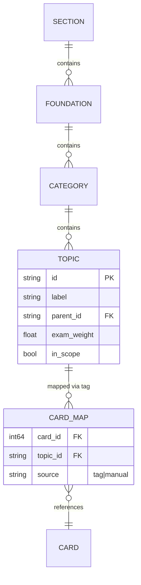

# Spec: Topic taxonomy & coverage

> The foundation three other specs stand on. It turns the AAMC MCAT content outline into a stored topic tree, maps deck cards onto it via tags, attaches per-topic exam weights, and computes coverage %. The queue orders by it, the scores gate on it, the study model groups by it. Companions: [`spec-engine-topic-queue`](spec-engine-topic-queue.md), [`spec-scores`](spec-scores.md), [`spec-study-model`](spec-study-model.md). Decisions: [D11](decisions.md#d11), [D12](decisions.md#d12). Status: design locked, unbuilt.
>
> **Authority:** frozen initial design. For current truth read `AGENTS.md` + the [decision log](decisions.md); a later decision overrides this doc where they conflict.

## 1. The problem this fills

Every other feature needs the same thing: a stable, exam-true notion of "topic." The blocked queue groups by it, the give-up rule and coverage % gate on it, and the principle-first scaffold's answer options *are* its nodes. Without one canonical taxonomy, each feature invents its own and they drift. This spec defines it once.

## 2. Goals & non-goals

**Goals**
- One canonical MCAT topic tree, sourced from the AAMC content outline.
- A reviewed mapping from deck cards → topic nodes via tags.
- Per-topic exam weight, for ordering ([D16](decisions.md#d16)) and later readiness weighting.
- Honest coverage %: which in-scope topics the deck actually covers.

**Non-goals**
- Auto-classifying untagged cards with AI (Friday+; Wednesday mapping is tag-driven).
- A general taxonomy for other exams ([D1](decisions.md#d1)).
- Per-card difficulty modeling (lives in [`spec-scores`](spec-scores.md)).

## 3. Grounding

The AAMC publishes the MCAT content outline as foundational concepts → content categories → topics; it is the literal blueprint the exam is built from, so coverage against it is the only coverage number that means anything. Card-count is the trap the brief calls out ([source §7c](../../Speedrun_%20A%20Desktop%20+%20Mobile%20Study%20App%20Built%20on%20Anki.md)): a 10k-card deck missing a high-weight category should never read as "ready," which is why coverage is node-based, not card-based ([D12](decisions.md#d12)).

## 4. The model

Three levels mirror the AAMC outline, plus a section mapping for the four scored MCAT sections:



Stored as a versioned data table shipped with the fork (not in the user collection), keyed so the same tree is identical on desktop and phone. Card→topic links live as a lightweight mapping derived from Anki tags, recomputed when tags change.

## 5. Mapping & weights

- **Tag convention:** topic nodes carry a canonical tag path (e.g. `mcat::biochem::amino_acids`); deck cards mapped by matching tags. An explicit `manual` override table handles mismatches.
- **Unmapped bucket:** cards matching no topic land in an `unmapped` bucket that is **surfaced, not hidden**, coverage honesty depends on admitting what isn't classified.
- **Weights:** `exam_weight` per topic, normalized within section, seeded from the AAMC section/category proportions; stored as data so they're tunable without code changes.

## 6. Coverage formula

```
in_scope_topics      = { t in TOPIC | t.in_scope }
covered_topics       = { t in in_scope_topics | has >=1 mapped card }
coverage_pct         = |covered_topics| / |in_scope_topics|       # node-based, NOT card-based
weighted_coverage    = sum(t.exam_weight for t in covered_topics) # for readiness later
```

| Deck | Cards | Topics covered / in-scope | coverage_pct | Reads as |
| :-- | :-- | :-- | :-- | :-- |
| Broad community deck | 9,800 | 95 / 100 | 95% | covered |
| Big but lopsided | 12,000 | 60 / 100 (skips a high-weight category) | 60% | gap shown; readiness still abstains on weighted gap |
| Authored subset | 1,200 | 40 / 100 | 40% | below give-up line → abstain |

## 7. UI surfaces

- A coverage strip on the dashboard: covered vs in-scope, with the biggest uncovered high-weight topics named.
- Topic picker for the principle-first scaffold draws its options from this tree ([`spec-study-model`](spec-study-model.md) §5).

## 8. Acceptance criteria

1. The AAMC outline is stored as a three-level tree (foundation → category → topic) with section mapping and per-topic `exam_weight`.
2. Deck cards map to topics via tags; an `unmapped` count is visible.
3. `coverage_pct` is node-based and displayed; a lopsided big deck reads below 100%.
4. The tree is identical on desktop and the phone build (shipped as data, not per-collection).
5. Pure coverage/weight helpers are unit-tested with a fixture deck.

## 9. Out of scope (now), tracked

- AI auto-tagging of unmapped cards → Friday.
- Per-topic difficulty/discrimination parameters → [`spec-scores`](spec-scores.md), Sunday.
- Editable taxonomy UI → post-Sunday.

## 10. Decisions & alternatives

Owned here: [D11](decisions.md#d11) (AAMC outline via tags), [D12](decisions.md#d12) (node-based coverage). Consumed: [D16](decisions.md#d16) (weights drive ordering), [D9](decisions.md#d9) (coverage feeds the give-up rule).

---

<sub>Created with the `iris-plan` skill by Iris Cai · maintained with `iris-log`.</sub>
